
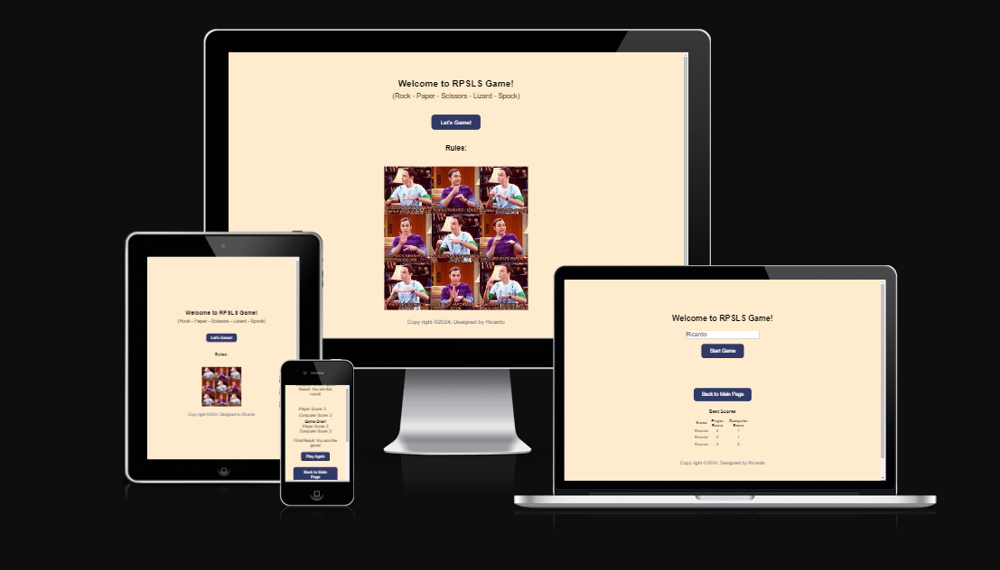

# RPSLS Game - (Rock - Paper - Scissors - Lizard - Spock)
### The game was mentioned in The Big Bang Theory.
### A five-gesture expansion of the classic selection method game rock-paper-scissors. It operates on the same basic principle, but includes two additional weapons: the lizard and Spock.

## ## [Live site](https://ricardomor98.github.io/Project2/)

# Features

  ## Header 

   - A welcoming to the Main Game page with an acronym (RPSLS) and with the meaning explanation under.
   - In the Game page the Header just identifies the acronym as the game name.

   

Header Screenshot

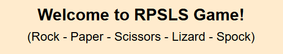
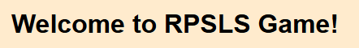

  ## Let's Game Buttom 

  - A button that redirects the user to the Game Page

  

Let`s Game button

  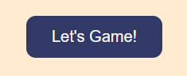

  

  ## Rules 

  - The rules of Rock-paper-scissors-lizard-Spock are:

             Scissors cut paper
             Paper covers rock
             Rock crushes lizard
             Lizard poisons Spock
             Spock smashes (or melts) scissors
             Scissors decapitate lizard
             Lizard eats paper
             Paper disproves Spock
             Spock vaporizes rock
             Rock breaks scissors

  - There are ten possible pairings of the five gestures; each gesture beats two of the other gestures and is beaten by the remaining two.

  

Rules Image

  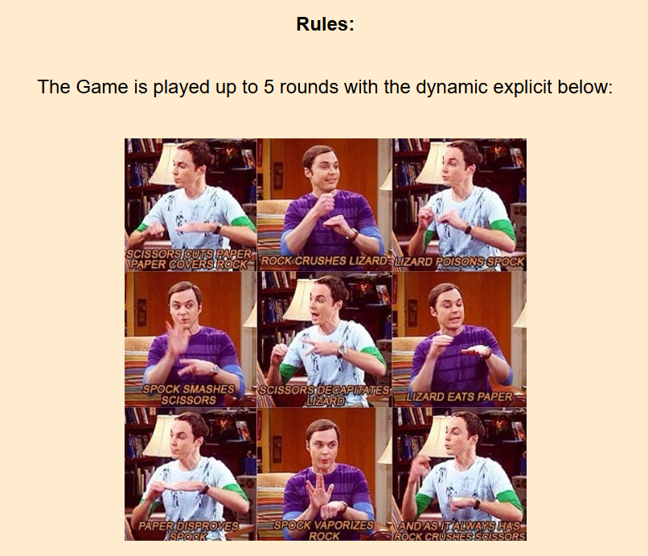

  
 

  ## Footer 

    -  The footer leads the user to the project's repository when the name is being clicked on from both Main Page and Game Page.

  

Foooter Image

  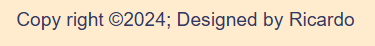

  

  ## Username Field  

    - It has a required username field in the game page that user has to fill in order to start the game.

  

Username Field

  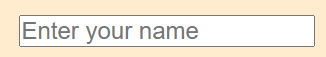

  

  ## Start Game Button

    - Once the username is filled the user can click the button to start the game.

  

Start Game Button

  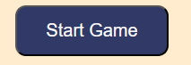

  
 

  ## Game Display 

    - Once Started Game display a good Welcoming to the user and  5 button options with different values for user to choose.

  

Game Display

  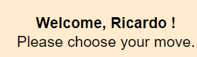
  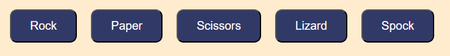

  
  

  ## Computer choice and Round result

    - Once player chooses one option the computer also takes a random choice that will lead to a result of: win,lose or draw.

  

Computer choice and Round result

  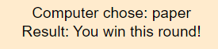

  
 

  ## Scoring System

    - The game is played in best of 5 rounds where the draw is not counted as a point for user or computer. After the 5 rounds finished there is a final result for the winner of the Game.

   

Scoring System

  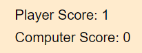
  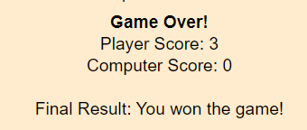
  
  

  ## End Game

    -   when game ends under the final score user has 2 button options to "Play Again" and the game restarts or "Back to Main Page".

  

Play Again or Back to Main Page button

  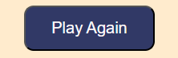
  
  
  

  ## Score Table

    - Under the "Back to Main Page" button there is a "Best Score" table for the best 5 results that is updating according to the next best.

  

Score Table

  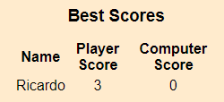
  
 

 